<div align="center">

# 🧩 ClinicaTEA

### Sistema de Gestão para Clínica de Transtorno do Espectro Autista


Sistema **desktop** para gestão de clínicas especializadas em TEA — controle de pacientes, equipe multidisciplinar, agenda com verificação de conflitos, evoluções de sessão, objetivos terapêuticos e relatórios gerenciais.

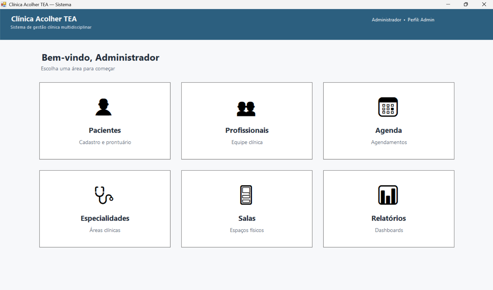

</div>

---

## ✨ Funcionalidades

| | Funcionalidade | Descrição |
|---|---|---|
| 🔐 | **Autenticação segura** | Hash SHA-256 + salt único por usuário |
| 👤 | **Cadastro de pacientes** | Dados clínicos do TEA: nível DSM-5, CIPTEA, responsável legal |
| 👩‍⚕️ | **Equipe multidisciplinar** | Profissionais por especialidade com código de conselho |
| 📅 | **Agenda inteligente** | Verificação automática de conflitos de profissional e sala |
| 📝 | **Evolução de sessão** | Humor, engajamento e conteúdo clínico por sessão |
| 🎯 | **Objetivos terapêuticos** | Por paciente/especialidade com % de atingimento |
| 📊 | **Relatórios gerenciais** | 7 tipos com filtro de período e impressão |

---

## 🖥️ Telas do Sistema

### 🔑 Login

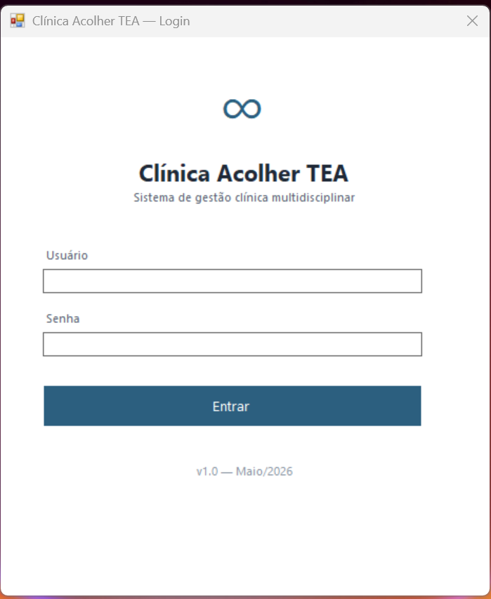

Autenticação com usuário e senha. Mensagens específicas para cada tipo de erro (senha incorreta vs. usuário não encontrado). Suporte a múltiplos perfis: **Admin**, **Recepção** e **Profissional**.

---

### 🏠 Dashboard


Ponto de navegação central com seis módulos. Cards com efeito de hover e layout responsivo ao redimensionamento da janela.

---

### 👤 Módulo de Pacientes

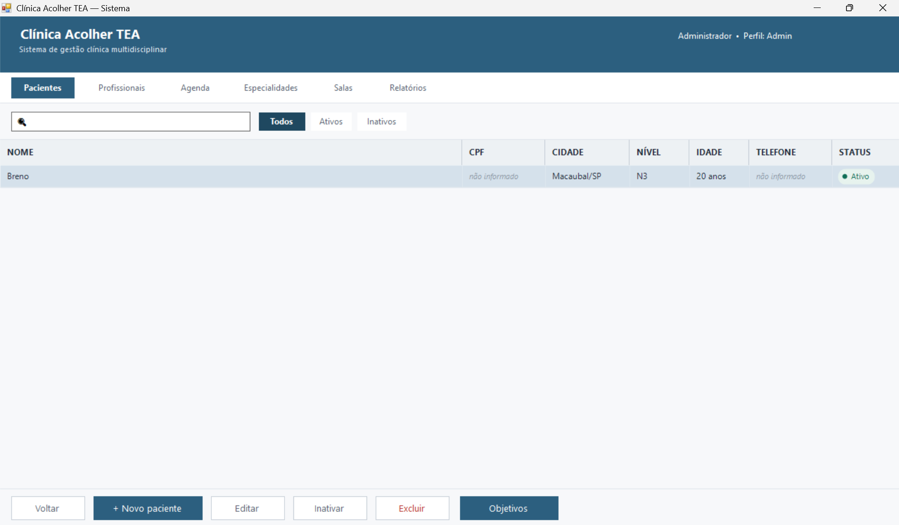

Listagem com busca em tempo real por nome, CPF ou nome social. Filtros por status (Todos / Ativos / Inativos). Colunas: nome, CPF, idade, cidade e nível de suporte DSM-5.

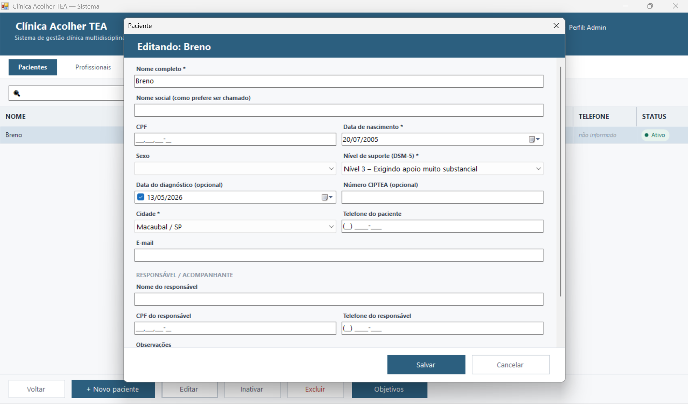

Formulário completo com dados pessoais, dados clínicos do TEA (nível de suporte, data do diagnóstico, número CIPTEA) e dados do responsável legal.

---

### 👩‍⚕️ Módulo de Profissionais

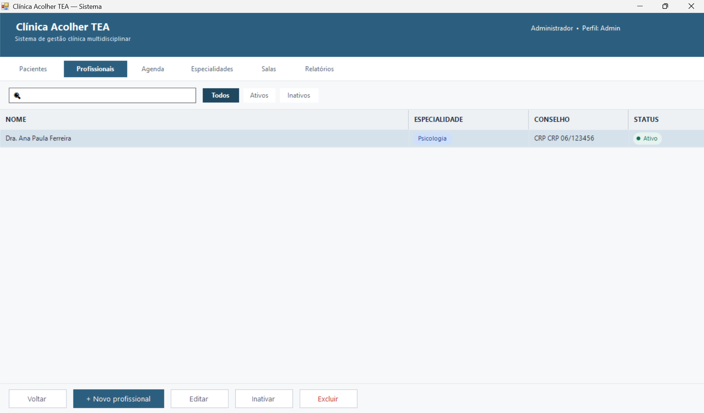

Listagem da equipe clínica com chip colorido por especialidade. Cada cor é configurável e usada em toda a interface.

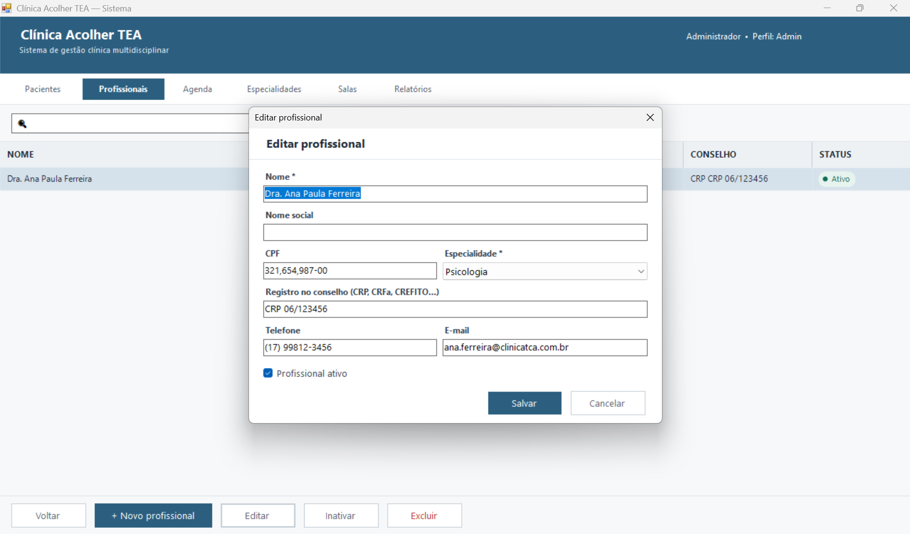

Registro de nome, CPF, registro no conselho (CRP, CRFa, CREFITO…), especialidade e contato.

---

### 🩺 Módulo de Especialidades

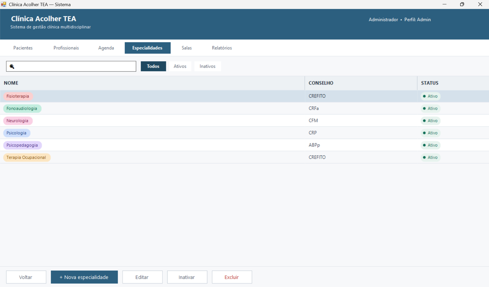

Gerencia as áreas clínicas com chips coloridos. A cor configurada é usada na agenda e em todos os módulos para identificação visual rápida.

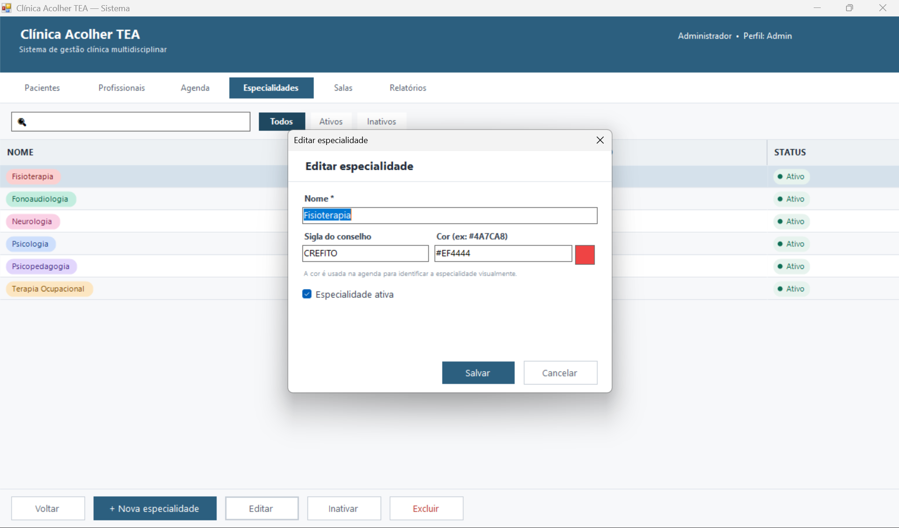

Cadastro de nome, sigla do conselho e cor em formato HEX com preview em tempo real.

---

### 🚪 Módulo de Salas

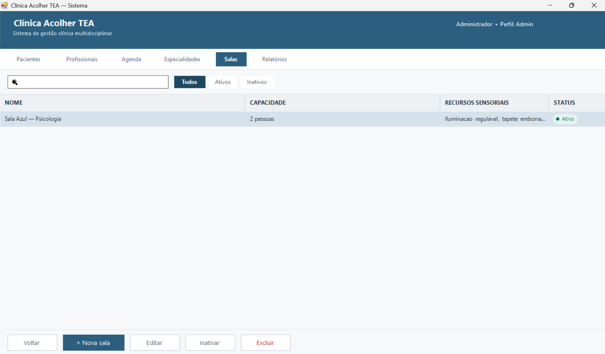

Cadastro dos espaços físicos com capacidade e recursos sensoriais (iluminação regulável, tapete emborrachado, caixa sensorial…), adaptações importantes para pacientes com TEA.

---

### 📅 Agenda

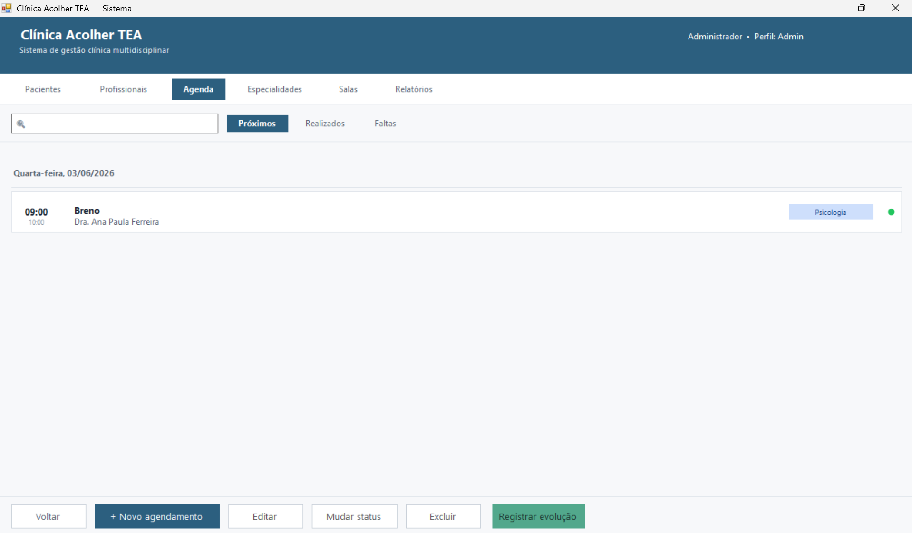

Agendamentos agrupados por data com cabeçalhos "Hoje" e "Amanhã" destacados. Dot colorido por status: 🟢 Agendado · ✅ Realizado · 🔴 Faltou · ⚫ Cancelado.

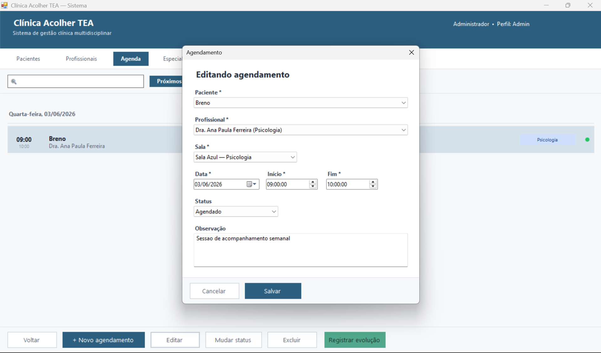

Novo agendamento com seleção de paciente, profissional e sala. Validação automática de conflitos de horário antes de salvar.

---

### 📝 Evolução de Sessão

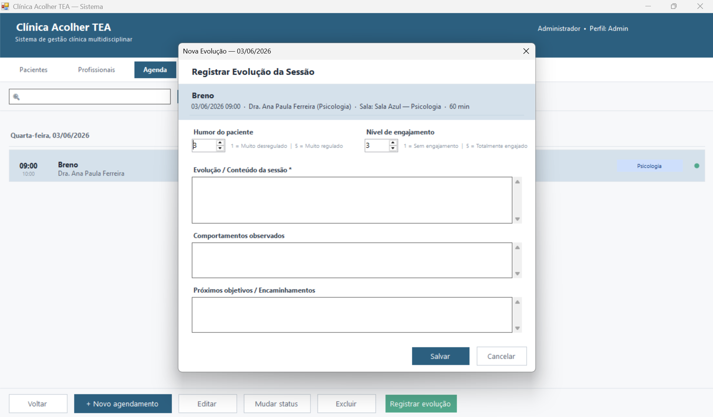

Registro clínico pós-sessão com escalas de humor (1–5) e engajamento (1–5), conteúdo da sessão, comportamentos observados e próximos encaminhamentos.

---

### 🎯 Objetivos Terapêuticos

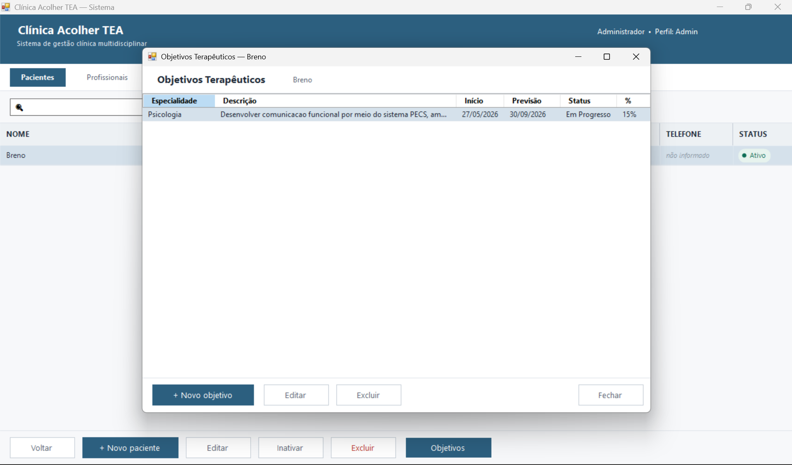

Objetivos por paciente, organizados por especialidade com status (Em Progresso / Concluído / Suspenso) e percentual de atingimento.

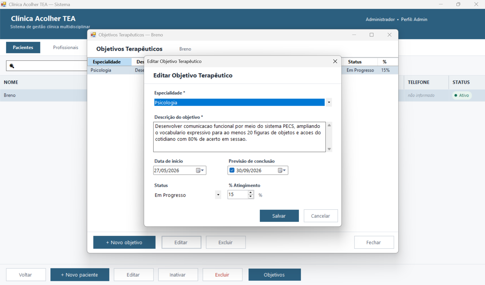

Cadastro com descrição livre, datas de início e previsão, especialidade vinculada e % de atingimento.

---

### 📊 Relatórios

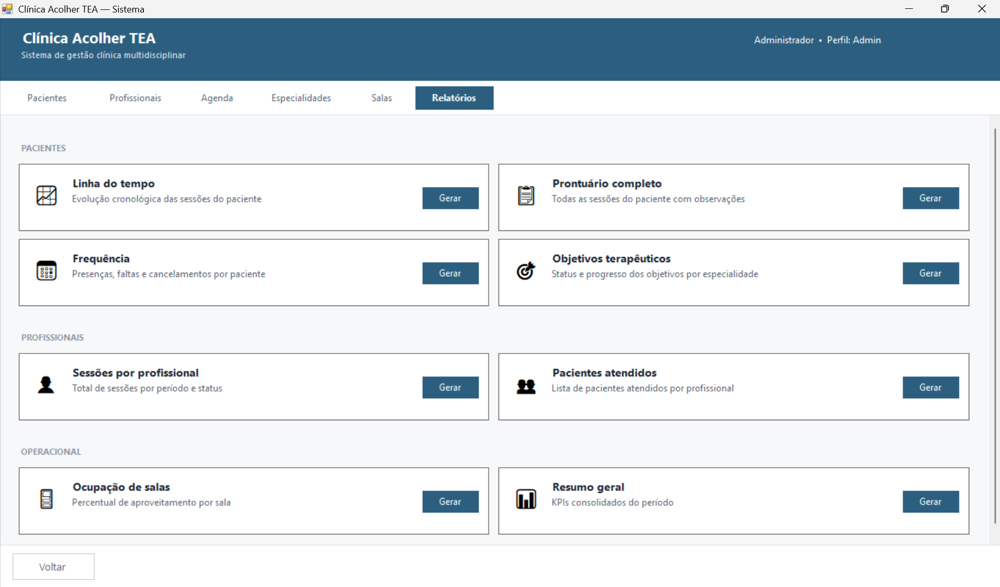

7 tipos de relatório divididos em três categorias: **Pacientes** (Linha do tempo, Prontuário, Frequência, Objetivos), **Profissionais** (Sessões, Pacientes atendidos) e **Operacional** (Ocupação de salas, Resumo geral).

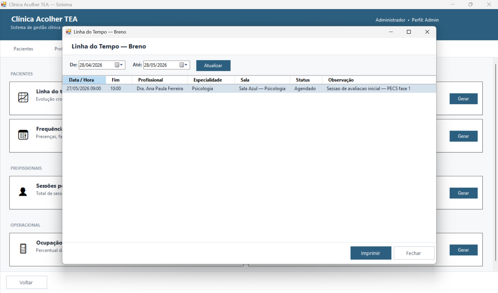

Visualizador com filtro de período "De / Até", botão de atualização e impressão com paginação automática via `PrintDocument`.

---

## 🛠️ Stack Técnica

| Camada | Tecnologia |
|---|---|
| Linguagem | C# (.NET Framework 4.7.2) |
| Interface | Windows Forms |
| Banco de dados | SQL Server Express 2019/2022 |
| ORM | Dapper 2.1.72 |
| Ícones | FontAwesome.Sharp 6.6.0 |
| Autenticação | SHA-256 + GUID salt (UTF-16 LE) |

### Arquitetura

```
SolucaoClinicaTEA/
├── CT_Negocio/       ← Camada de negócio (DAOs, modelos, serviços)
│   ├── DAOs/         ← Acesso a dados via Dapper
│   ├── Modelos/      ← POCOs mapeados para as tabelas
│   └── Servicos/     ← Regras de negócio e validações
├── CT_Win/           ← Camada de apresentação (Windows Forms)
│   ├── Forms/        ← Janelas modais (login, agendamento, evolução…)
│   └── UserControls/ ← Módulos carregados no painel central
└── DatabaseScripts/
    └── schema.sql    ← Script completo de criação do banco ⬅ COMECE AQUI
```

---

## ⚙️ Como Executar

### Pré-requisitos

| Ferramenta | Versão mínima |
|---|---|
| Windows | 10 / 11 |
| Visual Studio | 2022 Community (workload *".NET desktop development"*) |
| SQL Server Express | 2019 ou 2022 — instância `.\SQLEXPRESS` |

### 1. Banco de dados

```sql
-- Via sqlcmd:
sqlcmd -S .\SQLEXPRESS -E -i "SolucaoClinicaTEA\DatabaseScripts\schema.sql"
```

O script cria o banco `ClinicaTEA`, todas as tabelas, índices e já insere o usuário administrador padrão.

> **Login padrão:** `admin` / `admin123`

### 2. Compilar e executar

Abra `SolucaoClinicaTEA\SolucaoClinicaTEA.slnx` no Visual Studio e pressione **F5**.

Ou via MSBuild:

```powershell
$msbuild = "C:\Program Files\Microsoft Visual Studio\18\Community\MSBuild\Current\Bin\MSBuild.exe"

# Restaurar pacotes NuGet
& $msbuild "SolucaoClinicaTEA\SolucaoClinicaTEA.slnx" /t:Restore /p:RestorePackagesConfig=true /v:minimal

# Compilar em Release
& $msbuild "SolucaoClinicaTEA\SolucaoClinicaTEA.slnx" /p:Configuration=Release /v:minimal

# Executável gerado em: SolucaoClinicaTEA\CT_Win\bin\Release\CT_Win.exe
```

### String de conexão (`CT_Win/App.config`)

```xml
<add name="ClinicaTEA"
     connectionString="Data Source=.\SQLEXPRESS;Initial Catalog=ClinicaTEA;Integrated Security=true;"
     providerName="System.Data.SqlClient" />
```

---

## 📄 Documentação

O relatório técnico completo (ABNT NBR 14724) está disponível em:

- [`SolucaoClinicaTEA/relatorio_final.md`](SolucaoClinicaTEA/relatorio_final.md) — Markdown com todas as telas documentadas
- [`SolucaoClinicaTEA/SolucaoClinicaTEA.pdf`](SolucaoClinicaTEA/SolucaoClinicaTEA.pdf) — PDF gerado (documento de entrega)

---

## 🎓 Informações Acadêmicas

| | |
|---|---|
| **Curso** | Engenharia de Computação |
| **Disciplina** | Tópicos em Linguagem de Programação I |
| **Professor** | Prof. Fernando Datorre |
| **Aluno** | João Vitor Vissani da Silva Siani |
| **Ano** | 2026 |
